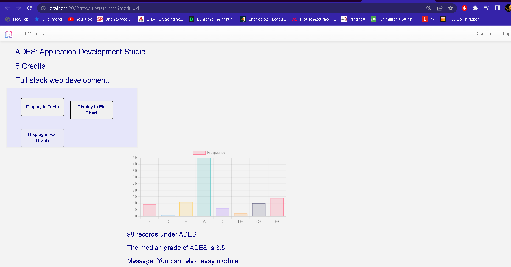

# **Advance GPA Calculator**
#### Made with PERN STACK
+ PostgreSQL
+ Express
+ React
+ NodeJS


___
## Pre-requisites installations
+ NodeJS
+ PgAdmin4
+ PostgreSQL

## To run the project:

1. Clone the repository / Download the zip file
2. In the terminal, run `npm install` in the root directory
3. In the terminal, run `psql -h localhost -d GPACalculatorDB -U postgres -f dumpfile.sql` to create the database. If prompted for a password, enter the password you set for the postgres user.
> This command will create the database and populate it with the required tables and data in your local PostgreSQL server.
3. In the terminal, run `npm start` in the root directory
4. In the browser, go to `localhost:3002`

___

### Pre-registered accounts(Many records of grades)

| Email | Password |
| ------ | ----------- |
| ``` covidtom@email.com ```  | ``` password ``` |
___


### Screenshots
> Home Page


> Modules Page

> Module Statistics Page

> Profile Page


> Search Page


___
